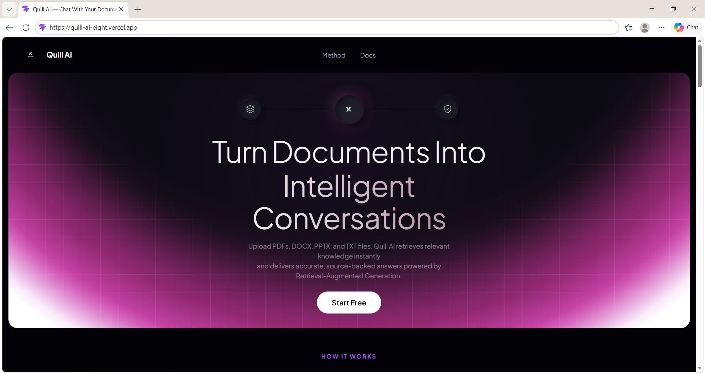
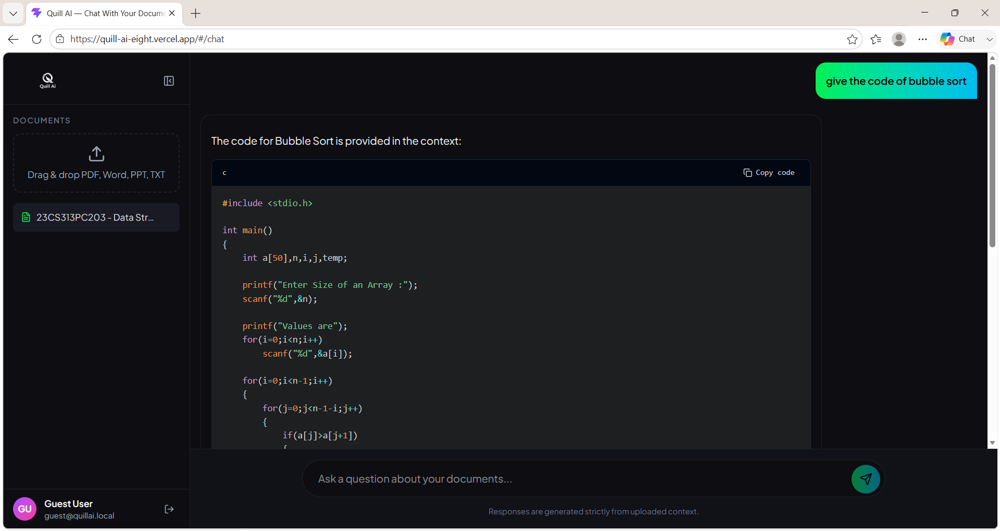
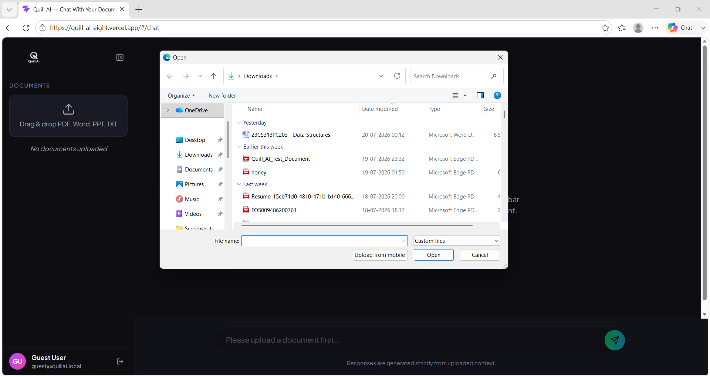

<div align="center">



# Quill AI

**Chat with your documents using AI — powered by Retrieval-Augmented Generation.**

Upload PDFs, Word docs, PowerPoints, or text files, then ask questions and get
accurate answers with cited sources and page numbers — grounded strictly in
your own content, not the model's general knowledge.

[](LICENSE)


[**Live Demo**](https://quill-ai-eight.vercel.app) · [Report a Bug](../../issues) · [Request a Feature](../../issues)

</div>

---

## 📔 Table of Contents

- [Overview](#-overview)
- [Screenshots](#-screenshots)
- [Features](#-features)
- [How It Works](#-how-it-works)
- [Tech Stack](#-tech-stack)
- [Folder Structure](#-folder-structure)
- [Getting Started](#-getting-started)
- [Environment Variables](#-environment-variables)
- [Deployment](#-deployment)
- [Contributing](#-contributing)
- [License](#-license)
- [Acknowledgements](#-acknowledgements)

---

## 🧠 Overview

Quill AI is a full-stack Retrieval-Augmented Generation (RAG) application. It
lets anyone upload their own documents and have a real conversation with
them — every answer is backed by the exact source passage and page number it
came from, so you can always verify what the AI is telling you.

Built as a solo full-stack project, covering everything from the React
frontend down to production infrastructure concerns like per-session data
isolation, automatic cleanup, and CORS hardening.

## 📷 Screenshots

<div align="center">

|                Landing Page                |               Chat with Sources             |
| :------------------------------------------: | :------------------------------------------: |
|                       |                             |

|              Document Upload                |               Guest / Sign-in                |
| :-------------------------------------------: | :-------------------------------------------: |
|                           |                           |

</div>

> _Add your own screenshots to `docs/screenshots/` and update the paths above._

## ✨ Features

- 📄 **Multi-format uploads** — PDF, DOCX, PPTX, and TXT
- 🔍 **Semantic retrieval** — vector search over your documents, not keyword matching
- 🔗 **Cited sources** — every answer shows the exact file, page number, and quoted snippet it came from
- 💬 **Strictly grounded answers** — the model is instructed to only use retrieved context, and says so honestly when it doesn't know
- 🔐 **Flexible auth** — sign in with GitHub, email/password, or continue as a guest
- 🧹 **Automatic data cleanup** — each session's documents are isolated and automatically purged on sign-out, tab close, or after a period of inactivity — nothing lingers forever
- 🚦 **Built-in safety limits** — per-file size cap, per-session document cap, and concurrency limits to keep the backend stable under multiple simultaneous users
- ⚡ **Fast inference** — powered by Groq's LPU inference for near-instant LLM responses

## ⚙️ How It Works

1. **Upload** — a document is chunked using LangChain's recursive text
   splitter and embedded with a HuggingFace `sentence-transformers` model
   (`all-MiniLM-L6-v2`), then stored in ChromaDB, tagged with a per-session ID.
2. **Ask** — your question is embedded the same way, and the most similar
   chunks from *your* session are retrieved via vector similarity search.
3. **Answer** — the retrieved chunks are passed as context to a Groq-hosted
   LLaMA 3.1 model, which is instructed to answer using *only* that context —
   with the exact source file, page number, and quoted snippet returned
   alongside the answer.

## 🧰 Tech Stack

**Frontend:** React · Vite · Tailwind CSS · Supabase Auth
**Backend:** FastAPI · Python · Uvicorn
**AI / RAG:** LangChain · HuggingFace Sentence-Transformers · ChromaDB · Groq (LLaMA 3.1)
**Infra:** Vercel (frontend) · Railway (backend)

## 📁 Folder Structure

```
Quill-AI/
├─ frontend/
│  ├─ public/
│  │  ├─ robots.txt
│  │  └─ sitemap.xml
│  ├─ src/
│  │  ├─ components/
│  │  ├─ App.jsx
│  │  ├─ Landing.jsx
│  │  ├─ Login.jsx
│  │  ├─ api.js
│  │  └─ supabase.js
│  ├─ generate-env.js
│  ├─ index.html
│  └─ package.json
├─ backend/
│  ├─ main.py
│  ├─ rag.py
│  └─ requirements.txt
├─ LICENSE
└─ README.md
```

## 🚀 Getting Started

### Prerequisites

- Node.js 18+ and npm
- Python 3.10+
- A [Groq API key](https://console.groq.com) (free tier available)
- A [Supabase](https://supabase.com) project (for authentication)

### 1. Clone the repository

```bash
git clone https://github.com/Gagan3287/Quill-AI.git
cd Quill-AI
```

### 2. Backend setup

```bash
cd backend
pip install -r requirements.txt --break-system-packages

# create a .env file with:
# GROQ_API_KEY=your_key_here
# ALLOWED_ORIGINS=http://localhost:5173

python main.py
```

The API will be available at `http://localhost:8000`.

### 3. Frontend setup

```bash
cd frontend
npm install

# create a .env file with:
# VITE_API_URL=http://localhost:8000/api
# VITE_SUPABASE_URL=your_supabase_url
# VITE_SUPABASE_ANON_KEY=your_supabase_anon_key

npm run dev
```

The app will be available at `http://localhost:5173`.

## 🔑 Environment Variables

**Backend (`backend/.env`)**

| Variable | Description |
|---|---|
| `GROQ_API_KEY` | API key for Groq's LLM inference |
| `ALLOWED_ORIGINS` | Comma-separated list of allowed frontend origins for CORS |
| `MAX_UPLOAD_BYTES` | Max file size in bytes (default: 8MB) |
| `MAX_DOCS_PER_SESSION` | Max documents per session (default: 8) |
| `MAX_CONCURRENT_UPLOADS` | Max simultaneous document embeddings (default: 2) |
| `SESSION_IDLE_TTL_SECONDS` | Idle time before a session is auto-cleared (default: 1200) |

**Frontend (`frontend/.env`)**

| Variable | Description |
|---|---|
| `VITE_API_URL` | Base URL of the backend API |
| `VITE_SUPABASE_URL` | Your Supabase project URL |
| `VITE_SUPABASE_ANON_KEY` | Your Supabase anon/public key |

## ☁️ Deployment

This project is deployed as two independent services:

- **Frontend** — deployed on [Vercel](https://vercel.com), auto-deploys on push to `main`
- **Backend** — deployed on [Railway](https://railway.app), auto-deploys on push to `main`

Live at **[quill-ai-eight.vercel.app](https://quill-ai-eight.vercel.app)**

## 🙌 Contributing

Contributions, issues, and feature requests are welcome. Feel free to check
the [issues page](../../issues) or open a pull request.

## 📃 License

Distributed under the MIT License. See [`LICENSE`](LICENSE) for details.

## 💎 Acknowledgements

- [LangChain](https://www.langchain.com/) for the RAG orchestration primitives
- [Groq](https://groq.com/) for fast, free-tier LLM inference
- [ChromaDB](https://www.trychroma.com/) for the vector store
- [Supabase](https://supabase.com/) for authentication

---

<div align="center">

If you found this useful, consider giving it a ⭐

</div>
